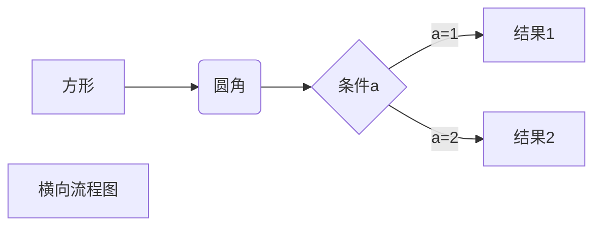

# 基于kubernetes的分布式限流

做为一个数据上报系统，随着接入量越来越大，由于 API 接口无法控制调用方的行为，因此当遇到瞬时请求量激增时，会导致接口占用过多服务器资源，使得其他请求响应速度降低或是超时，更有甚者可能导致服务器宕机。 
## 一、概念
限流(Ratelimiting)指对应用服务的请求进行限制，例如某一接口的请求限制为 100 个每秒,对超过限制的请求则进行快速失败或丢弃。 
### 1.1 使用场景
限流可以应对： 
- 热点业务带来的突发请求；
- 调用方 bug 导致的突发请求；
- 恶意攻击请求。

### 1.2 维度
对于限流场景，一般需要考虑两个维度的信息：
**时间**
限流基于某段时间范围或者某个时间点，也就是我们常说的“时间窗口”，比如对每分钟、每秒钟的时间窗口做限定
**资源**
基于可用资源的限制，比如设定最大访问次数，或最高可用连接数。
  限流就是在某个时间窗口对资源访问做限制，比如设定每秒最多100个访问请求。在实际的业务场景中，一般都是多种限流规则同时使用，主要的几种限流规则如下：


### 1.3 分布式限流
分布式限流相比于单机限流，只是把限流频次分配到各个节点中，比如限制某个服务访问100qps，如果有10个节点，那么每个节点理论上能够平均被访问10次，如果超过了则进行频率限制。

## 二、分布式限流常用方案
**基于Guava的客户端限流**
Guava是一个客户端组件，在其多线程模块下提供了以RateLimiter为首的几个限流支持类。它只能对“当前”服务进行限流，即它不属于分布式限流的解决方案。

**网关层限流**
服务网关，作为整个分布式链路中的第一道关卡，承接了所有用户来访请求。我们在网关层进行限流，就可以达到了整体限流的目的了。目前，主流的网关层有以软件为代表的Nginx，还有Spring Cloud中的Gateway和Zuul这类网关层组件，也有以硬件为代表的F5。

**中间件限流**
将限流信息存储在分布式环境中某个中间件里（比如Redis缓存），每个组件都可以从这里获取到当前时刻的流量统计，从而决定是拒绝服务还是放行流量。

**限流组件**
目前也有一些开源组件提供了限流的功能，比如Sentinel就是一个不错的选择。Sentinel是阿里出品的开源组件，并且包含在了Spring Cloud Alibaba组件库中。Hystrix也具有限流的功能。

Guava的Ratelimiter设计实现相当不错，可惜只能支持单机，网关层限流如果是单机则不太满足高可用，并且分布式网关的话还是需要依赖中间件限流，而redis之类的网络通信需要占用一小部分的网络消耗。阿里的Sentinel也是同理，底层使用的是redis或者zookeeper，每次访问都需要调用一次redis或者zk的接口。那么在云原生场景下，我们有没有什么更好的办法呢？

对于极致追求高性能的服务不需要考虑熔断、降级来说，是需要尽量减少网络之间的IO，那么是否可以通过一个总限频然后分配到具体的单机里面去，在单机中实现平均的限流，比如限制某个ip的qps为100，服务总共有10个节点，那么平均到每个服务里就是10qps，此时就可以通过guava的ratelimiter来实现了，甚至说如果服务的节点动态调整，单个服务的qps也能动态调整。


## 三、基于kubernetes的分布式限流




定义一个RateLimiterService

```java
private final LoadingCache<String, RateLimiter> loadingCache = Caffeine.newBuilder()
  .maximumSize(10_000)
  .refreshAfterWrite(20, TimeUnit.MINUTES)
  .build(this::createRateLimit);

//定义一个默认最小的QPS
private static final Integer minQpsLimit = 3000;
```


```java
public RateLimiter createRateLimit(String ip) {
  log.info("createRateLimit,appId:{}", ip);
  int totalLimit = 根据ip获取所配置的总qps;
  Integer replicas = kubernetesService.getDeploymentReplicas();
  log.info("totalLimit:{},replicas:{}", totalLimit, ip);
  RateLimiter rateLimiter;
  if (totalLimit > 0 && replicas == null) {
    rateLimiter = RateLimiter.create(totalLimit);
  } else if (totalLimit > 0) {
    int nodeQpsLimit = totalLimit / replicas;
    rateLimiter = RateLimiter.create(nodeQpsLimit > minQpsLimit ? nodeQpsLimit : minQpsLimit);
  } else {
    rateLimiter = RateLimiter.create(minQpsLimit);
  }
  log.info("create rateLimiter success,ip:{},rateLimiter:{}", ip, rateLimiter);
  return rateLimiter;
}
```


```java
public RateLimiter getRateLimiter(String ip) {
  return loadingCache.get(ip);
}
```


```java
public class RateLimiterFilter implements Filter {
    @Resource
    private RateLimiterService rateLimiterService;

    @Override
    public void doFilter(ServletRequest request, ServletResponse response, FilterChain filterChain) throws IOException, ServletException {
        HttpServletRequest httpServletRequest = (HttpServletRequest) request;
        HttpServletResponse httpServletResponse = (HttpServletResponse) response;
        String ip = httpServletRequest.getHeader("ip");
        RateLimiter rateLimiter = rateLimiterService.getRateLimiter(ip);
        if (rateLimiter != null) {
            if (rateLimiter.tryAcquire()) {
                filterChain.doFilter(request, response);
            } else {
                httpServletResponse.setStatus(HttpStatus.TOO_MANY_REQUESTS.value());
            }
        } else {
            filterChain.doFilter(request, response);
        }
    }
}
```


## 参考
1.[常见的分布式限流解决方案](https://blog.csdn.net/hou_ge/article/details/113869419)
2.[分布式服务限流实战](https://www.infoq.cn/article/qg2tx8fyw5vt-f3hh673)
3.[高性能](https://www.cnblogs.com/huilei/p/13773557.html)

