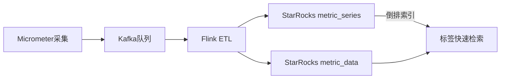
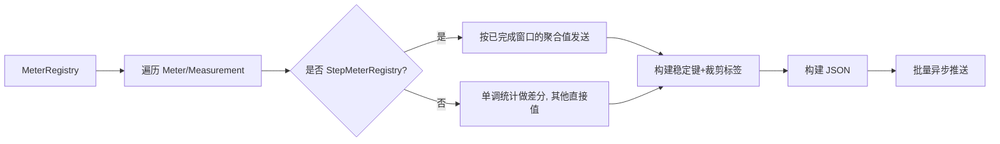

# 监控指标上报Starrocks

## 一、 背景与目标  
  
监控最主要还是上报到Prometheus，可惜成本实在是高昂，特别是存储时间要求得越久，我们这里探索了下micrometer转换成json，然后存储到starrocks这类mpp olap引擎，通过starrocks的存算分离架构，降低成本。
  
---  
  
## 二、 总体架构  
    
```text
Spring Boot + Micrometer --指标采集--> Kafka --消息流--> Flink --清洗/聚合/分流--> StarRocks (metric_data / metric_series)
```

---  
  
## 三、 存储方案对比  
我们以一串json为例
```json  
{  
  "metricName": "cpu_usage",  
  "labels": {  
    "host": "server-01",  
    "region": "us-east"  
  },  
  "timestamp": "2025-10-15T08:01:12.123Z",  
  "value": 0.73  
}  
  
```
  直接可以对第一层key建表，metricName、timestamp、value都可以直接约定为列，目前问题的核心主要有两个：
  （1）labels如何存储
  （2）针对Histogram、Summary、Gauge的上报如何处理。
  我们先来解决第一个问题，labels如何存储。
  
### 3.1 方案一：字符串拼接
如果维度比较少的情况下，确实可以考虑通过字符串截取来实现，比如上面的存储为**server-01|us-east**，通过split竖线来获取响应的字段，例如：

```sql
SPLIT_PART('server-01|us-east', '|', 1) AS host_value,
SPLIT_PART('server-01|us-east', '|', 2) AS region_value
```
这种如果labels多的情况下，需要自行约定字符串的顺序，而且数据量的情况下，SPLIT_PART性能消耗也比较大。

### 3.2 方案二：指标表 + 标签维表 + 倒排索引  

  这种主要是想把指标和labels拆出来放到不同的两个表里，同时使用一个唯一id关联为一批数据，一开始有点豁然开朗，后来一想，（1）维度如果很多，但是只查一个维度的数据，这种关联不准确；（2）如果要关联查询，特别是维度多的情况下，sql复杂度翻好几倍，维护性大大降低。
  
  
### 3.3 方案三：Flat JSON 存储  
  
考虑了一下简单粗暴的方法，labels直接存储为JSON列，刚好看到starrocks的新特性Flat JSON，Flat JSON的核心原理是在导入时检测JSON数据，并从JSON数据中提取常用字段，作为标准类型数据存储。在查询JSON时，这些常用字段优化了JSON的查询速度，刚好符合我们的条件。

```sql
CREATE TABLE monitor_data  
(  
    ts      DATETIME COMMENT '指标时间',  
    name STRING COMMENT '指标名称',  
    env STRING COMMENT '环境',  
    dc STRING COMMENT '数据中心',  
    biz_id BIGINT COMMENT '业务 ID',  
    labels  JSON COMMENT '指标标签（JSON 格式）',  
    value   DOUBLE COMMENT '指标值'  
)  
    ENGINE = OLAP DUPLICATE KEY(`ts`,`name`,`env`,`dc`,`biz_id`)  
COMMENT "监控"  
PARTITION BY date_trunc('day', ts)  
DISTRIBUTED BY HASH(`name`,`env`,`dc`,`biz_id`)  
ORDER BY (`name`,`ts`)  
PROPERTIES (  
"compression" = "LZ4",  
"flat_json.enable" = "true",
"fast_schema_evolution" = "false",  
"partition_live_number" = "366",  
"replicated_storage" = "true",  
"replication_num" = "3"  
);
```

---  
  
## 四、针对Histogram、Summary、Gauge的上报如何处理

Micrometer主要分为两种注册表，会直接直接影响我们“是否做差分”和“何时发布”：
- StepMeterRegistry（例如 Graphite、Datadog 等推送型注册表）：以固定步长窗口聚合（step），`meter.measure()`返回“上一个已完成窗口”的聚合值。发布策略应“按窗口发布一次”，不做差分。
- 非 Step 注册表（例如 SimpleMeterRegistry，或直接从 `PrometheusMeterRegistry` 读取聚合值）：`meter.measure()`返回当前瞬时或累计值。对于单调累计的统计（Counter、Timer 总时长、Summary 总和等），需要自行做“差分”以避免把累计值当作新增量。

最主要的是针对累计值，我们需要如何做差分。
  
### 4.1  Caffeine缓存
为了方便计算差分，我们需要对周期内的数据进行缓存，最初用的是map，但是考虑到会累计的指标和维度越来越多占用内存，这里改用Caffeine缓存，用expireAfterAccess将过期的数据自动清理。
```java  
// 非 Step 注册表的单调统计差分基线
private final Cache<String, Double> lastValues = Caffeine.newBuilder()
        .expireAfterAccess(Duration.ofHours(1))
        .maximumSize(100_000)
        .build();

// Step 注册表每个 key 的“上一个已发布窗口索引”
private final Cache<String, Long> lastPublishedStepIndex = Caffeine.newBuilder()
        .expireAfterAccess(Duration.ofHours(1))
        .maximumSize(100_000)
        .build();

```  
- lastValues：保存“上次看到的累计值”，这样下次可以算出新增量。
- lastPublishedStepIndex：记录“某个指标在上一个窗口是否已发布”，避免重复发同一窗口。

### 4.2 那些需要做差分
```java
private boolean isMonotonicStatistic(String stat) {
    return "COUNT".equals(stat)
            || "TOTAL".equals(stat)
            || "TOTAL_TIME".equals(stat)
            || "SUM".equals(stat);
}

```
  - 像 `COUNT`（次数）、`TOTAL`（总和）、`TOTAL_TIME`（总时长）、`SUM`（分布总和）这类都是越加越多的，适合在非 Step 场景下发“增量”。
### 4.3 核心处理流程
```java
@Scheduled(fixedRate = DEFAULT_STEP_MILLIS)
public void sendMetrics() {
    long now = System.currentTimeMillis();
    long currentStepIndex = (isStepRegistry ? now / stepMillis : -1);
    long prevCompletedStepIndex = (isStepRegistry ? Math.max(0, currentStepIndex - 1) : -1);

    List<Meter> meters = meterRegistry.getMeters();
    List<Map<String, Object>> payloadList = new ArrayList<>();

    for (Meter meter : meters) {
        Meter.Type type = meter.getId().getType();

        for (Measurement measurement : meter.measure()) {
            String key = buildStableKey(meter, measurement);
            double currentValue = measurement.getValue();
            double valueToSend;

            if (isStepRegistry) {
                // Step：只发“上一个已完成窗口”的值，而且只发一次
                Long lastIdx = lastPublishedStepIndex.getIfPresent(key);
                if (lastIdx != null && lastIdx >= prevCompletedStepIndex) {
                    continue; // 已发过
                }
                if (currentValue <= 0) {
                    // 窗口里没有事件，标记一下避免下次再检查
                    lastPublishedStepIndex.put(key, prevCompletedStepIndex);
                    continue;
                }
                valueToSend = currentValue;
                lastPublishedStepIndex.put(key, prevCompletedStepIndex);

            } else {
                // 非 Step：单调累积做差分，Gauge/非单调直接发
                String stat = measurement.getStatistic().name();
                boolean monotonic = isMonotonicStatistic(stat);

                if (type == Meter.Type.GAUGE || !monotonic) {
                    valueToSend = currentValue;
                } else {
                    Double last = lastValues.getIfPresent(key);
                    if (last == null) {
                        // 第一次见到，只记不发
                        lastValues.put(key, currentValue);
                        continue;
                    }
                    double delta = currentValue - last;
                    lastValues.put(key, currentValue); // 先更新基线，避免误判

                    if (delta <= 0) {
                        // 计数器复位或没有新增，不发
                        continue;
                    }
                    valueToSend = delta;
                }
            }

            Map<String, Object> payload = buildPayload(meter, measurement, valueToSend);
            payloadList.add(payload);
        }
    }

    // 可改造为分片或真正批量接口
    sendAsync(payloadList);
}
```

### 4.4 ## 构建 JSON：命名规范、标签与时间戳
把读到的值拼进一个统一的 JSON 字段结构，便于下游消费。
```java
private Map<String, Object> buildPayload(Meter meter, Measurement measurement, double valueToSend) {
    Map<String, String> labels = meter.getId().getTags().stream()
            .collect(Collectors.toMap(Tag::getKey, Tag::getValue));
    String bizId = labels.getOrDefault("biz_id", "0");
    labels.remove("biz_id");

    String metricName;
    if (measurement.getStatistic() == Statistic.COUNT) {
        metricName = meter.getId().getName();
    } else {
        metricName = meter.getId().getName() + "_" + measurement.getStatistic().name().toLowerCase();
    }

    return Map.of(
            "ts", DateTime.now().toString("yyyy-MM-dd HH:mm:ss.SSS"), // 时间戳
            "name", metricName,                                      // 指标名
            "env", UserContext.env,                                  // 环境
            "dc", "eu",                                         // 机房/区域
            "biz_id", bizId,                                       // 可选业务字段
            "labels", labels,                                        // 标签
            "value", valueToSend                                     // 数值
    );
}

```

### 4.5 获取 Step 步长：尽量与注册表配置对齐
对于 StepMeterRegistry，我们希望知道它的步长（窗口大小），以便定时任务与之对齐。
```java
private long resolveStepMillis(MeterRegistry registry, long fallback) {
    try {
        Method configMethod = registry.getClass().getMethod("config");
        Object configObj = configMethod.invoke(registry);
        if (configObj != null) {
            Method stepMethod = configObj.getClass().getMethod("step");
            Object duration = stepMethod.invoke(configObj);
            if (duration instanceof Duration) {
                return ((Duration) duration).toMillis();
            }
        }
    } catch (NoSuchMethodException e) {
        log.warn("No public config() or step() on registry {}, fallback to {} ms",
                registry.getClass().getName(), fallback);
    } catch (Exception e) {
        log.warn("Resolve stepMillis via reflection failed, fallback to {} ms", fallback, e);
    }
    return fallback;
}

```
- 优先反射拿到真实步长；如果失败就用默认值。
- 也可以改成通过配置文件设置，灵活性更高。

##  五、 示例 JSON

- 计数器（非 Step，做差分）：

```json
{
  "ts": "2024-06-01 12:00:00.000",
  "name": "http_requests_count",
  "env": "prod",
  "dc": "eu",
  "biz_id": "0",
  "labels": { "method": "GET", "status": "200" },
  "value": 42
}

```

- 定时器（Step，发送窗口聚合值）：

```json
{
  "ts": "2024-06-01 12:00:00.000",
  "name": "http_server_requests_total_time",
  "env": "prod",
  "dc": "eu",
  "labels": { "uri": "/api/orders", "method": "POST" },
  "value": 3.14159
}

```

写入数据后展示：

| ts | name | env | dc | biz_id | labels                           | value |
|---------------------|---------------------------------|------|---------|---------|----------------------------------|---------|
| 2024-06-01 12:00:00 | http_requests_count | prod | eu | 0 | {"status":"200","method":"POST"} | 3.14159 |


- 最近 5 分钟各接口请求数（以 http_requests_count 为例，按 method/status 维度聚合）：
```sql
SELECT
  JSON_VALUE(labels, '$.method') AS method,
  JSON_VALUE(labels, '$.status') AS status,
  SUM(value) AS total_requests
FROM monitor_data
WHERE name = 'http_requests_count'
  AND ts >= NOW() - INTERVAL 5 MINUTE
  AND env = 'prod'
  AND dc = 'eu'
GROUP BY method, status
ORDER BY total_requests DESC;
```

